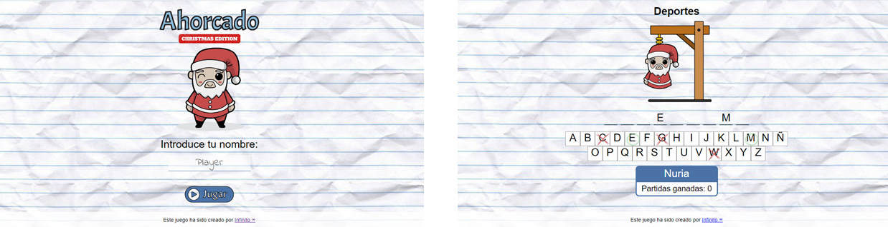

  

Introducción
-------------
Segundo proyecto en grupo para desarrollar un juego de mesa tradicional empleando la lógica de programación de JavaScript, usando también los fundamentos de HTML5 y CSS3. 

  

Descripción
-------------
* Juego con un array limitado de opciones y con un único nivel de dificultad.
* Almacenamiento de las partidas ganadas por jugador en el LocalStorage.
* Ranking de los mejores jugadores según las partidas ganadas.
* Diseño responsive que se adapta a la pantalla de cualquier dispositivo.

Características
-------------
* HTML5
* CSS3
* JavaScript
* SCSS
* JSON
* LocalStorage
* Metodología BEM

Colaboración
-------------

